# 📍 APEX ROUTE
**Autonomous Logistics AI // Team Requiem**

Global supply chains are volatile. Weather events and geopolitical conflicts cause massive delays because human dispatchers react *after* the disruption happens. **Apex Route** is an autonomous, multi-agent AI system that preemptively detects transit threats and dynamically reroutes global shipments before bottlenecks cascade.

Built for the 2026 Solution Challenge.

---

## 🛠️ The Tech Stack
* **Orchestration:** LangGraph (Multi-Agent State routing)
* **The Brain:** Groq API (Lightning-fast LLM Inference)
* **Backend:** FastAPI & Python
* **Frontend:** Next.js, React, Tailwind CSS
* **The "Senses" (APIs):** OpenWeather, NewsAPI, OpenStreetMap (Nominatim), OSRM (Routing)

---

## 🧠 How the AI Works (The Engine)

Apex Route isn't just a basic chatbot; it uses a **Supervisor Agent Pattern** to execute a deterministic LangGraph workflow.

1. 🕵️ **Intel Node (Worker):** Scrapes real-time weather and breaking global news based on the shipment's destination.
2. 🧠 **Risk Oracle (Supervisor):** A Groq-powered LLM reads the raw intel, calculates the physical threat to the shipment, and assigns a strict `Risk Level` (0.0 to 1.0).
3. 🔀 **The Router (Logic):** If the risk is below 70%, the AI approves the route and sleeps. If the risk is ≥ 70%, it wakes up the Dispatcher.
4. ⚡ **Dispatcher Node (Worker):** Bypasses the threat by pinging open-source GPS grids (OSRM) to calculate a physical, alternative driving route with exact kilometers and an updated ETA.

### The LangGraph Architecture

```mermaid
graph LR
    A((Start)) --> B[🕵️ Intel Gatherer]
    B --> C[🧠 Risk Oracle]
    
    C --> D{Risk ≥ 0.70?}
    
    D -->|YES: Red Alert| E[⚡ Dispatcher]
    D -->|NO: Safe| F((End))
    
    E --> F
    
    style A fill:#1a202c,stroke:#fff
    style B fill:#2c5282,stroke:#fff
    style C fill:#7c2d12,stroke:#fff
    style D fill:#1a202c,stroke:#fff
    style E fill:#0f766e,stroke:#fff
    style F fill:#22543d,stroke:#fff
```


---

## 🚀 Getting Started

Want to run the Apex Route Command Center locally? Here is how to spin it up.

### 1. Environment Setup
You will need a few free API keys to act as the AI's senses. Create a `.env` file inside the `/backend` folder and add these:
```text
GROQ_API_KEY=your_groq_key
OPENWEATHER_API_KEY=your_weather_key
NEWS_API_KEY=your_news_key
```

### 2. Boot the Python Engine (Backend)
Open a terminal and start the FastAPI server:
```bash
cd backend
python -m venv venv
source venv/bin/activate  # On Windows use: venv\Scripts\activate
pip install -r requirements.txt

uvicorn main:app --reload
```
*The AI engine is now listening on `http://localhost:8000`*

### 3. Boot the Command Center (Frontend)
Open a second terminal and start the Next.js UI:
```bash
cd frontend
npm install
npm run dev
```
*Access the dashboard at `http://localhost:3000`*

---

## 💻 Usage Example
1. Open the Command Center in your browser.
2. Enter a high-risk land route (e.g., Origin: `Kyiv`, Destination: `Warsaw`).
3. Click **Analyze Route**.
4. Watch the AI scrape the geopolitical news, assign a critical risk score, and dynamically calculate an evasive highway detour via the open-source OSRM network.

---
*Built with chaos-management in mind by Team Requiem.* 💀
```
