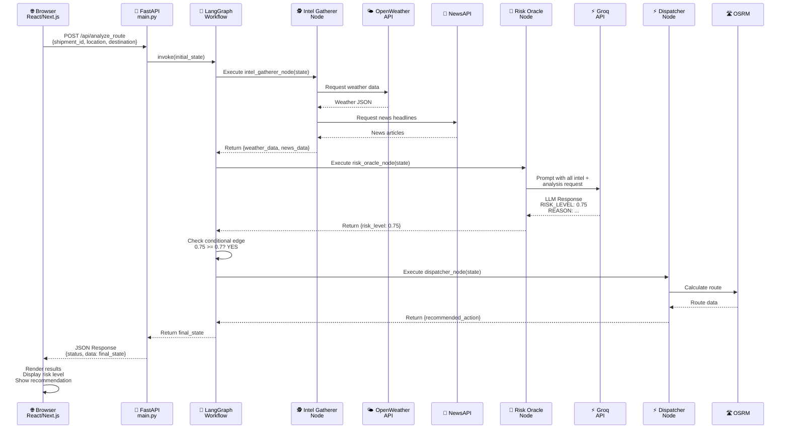
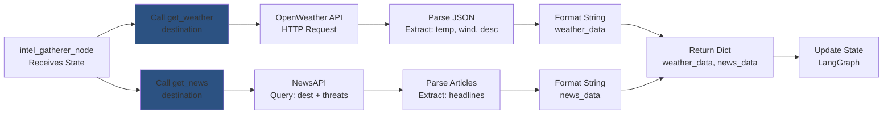
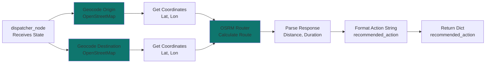
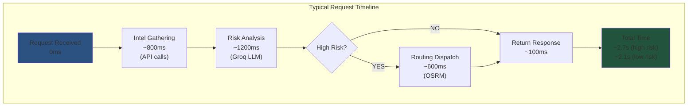

# � APEX ROUTE - Autonomous Logistics AI

**Autonomous Logistics AI // Team Requiem**

A sophisticated AI-powered logistics optimization system that analyzes shipment routes in real-time using multi-agent agentic workflows, gathering intelligence, assessing risk, and recommending intelligent rerouting decisions via a Groq-powered Supervisor LLM.

---

## 🎯 Overview

APEX ROUTE is a production-ready logistics platform that implements a **Supervisor Agent Pattern** with LangGraph and Groq. The system orchestrates multiple specialized agents that work in concert to make intelligent routing decisions in real-time.

**Key Features:**
- ✅ Real-time shipment route analysis via multi-agent workflow
- ✅ Groq-powered Supervisor LLM for deterministic decision-making
- ✅ Worker agents for intelligence gathering and optimization
- ✅ Real-time weather & news integration
- ✅ Dynamic risk assessment with conditional routing
- ✅ Modern React/Next.js frontend with cursor support
- ✅ RESTful FastAPI backend with CORS enabled
- ✅ Production-ready error handling and logging

---

## 📁 Project Structure

```
apex_route/
├── backend/                          # FastAPI backend server
│   ├── main.py                      # FastAPI app + CORS setup
│   ├── requirements.txt             # Python dependencies
│   ├── .env                         # Environment variables (GITIGNORED)
│   ├── check_models.py              # Model validation
│   ├── test_run.py                  # Test suite
│   └── apex_engine/                 # Core agentic engine
│       ├── graph.py                 # LangGraph workflow definition
│       ├── state.py                 # SupplyChainState TypedDict
│       ├── nodes.py                 # Agent node implementations
│       └── tools.py                 # External API tools
│
├── frontend/                         # Next.js React frontend
│   ├── app/
│   │   ├── page.tsx                 # Command Center UI
│   │   ├── layout.tsx               # Root layout
│   │   └── globals.css              # Tailwind styles
│   ├── package.json                 # React/Next.js dependencies
│   └── tsconfig.json                # TypeScript config
│
├── .gitignore                        # Root git ignore
└── README.md                         # This file
```

---

## 🏗️ Complete System Architecture

This diagram shows how all components connect together:

```mermaid
graph TB
    A["🌐 Client Browser<br/>React/Next.js"] -->|HTTP POST<br/>/api/analyze_route| B["📡 FastAPI Server<br/>Port 8000"]
    B -->|CORS Enabled| A
    
    B -->|Invoke| C["🔀 LangGraph Workflow<br/>StateGraph"]
    C -->|Entry Point| D["🕵️ AGENT 1<br/>Intel Gatherer<br/>Worker Agent"]
    
    D -->|Fetch Weather| E["🌤️ OpenWeather API"]
    D -->|Fetch News| F["📰 NewsAPI"]
    E -->|Weather Data| D
    F -->|News Data| D
    
    D -->|Update State| C
    C -->|Edge: Always to Oracle| G["🧠 AGENT 2<br/>Risk Oracle<br/>Supervisor LLM"]
    
    G -->|Remote Inference| H["⚡ Groq API<br/>Fast LLM Inference<br/>Temperature: 0.1"]
    H -->|Risk Score + Reason| G
    G -->|Update State| C
    
    C -->|Conditional Edge<br/>check_risk_level| I{Risk ≥ 0.7?}
    
    I -->|YES| J["⚡ AGENT 3<br/>Dispatcher<br/>Worker Agent"]
    I -->|NO| K["✅ END<br/>Route is Safe"]
    
    J -->|Geocode| L["🗺️ OpenStreetMap<br/>Nominatim API"]
    J -->|Route| M["🛣️ OSRM Router<br/>Open Source Routing"]
    L -->|Coordinates| J
    M -->|Alternative Route| J
    
    J -->|Update State| C
    C -->|Edge: Always| K
    
    K -->|Return Final State| B
    B -->|JSON Response| A
    
    style A fill:#4a5568
    style B fill:#2d3748
    style C fill:#1a202c
    style D fill:#2c5282
    style G fill:#7c2d12
    style H fill:#ea580c
    style J fill:#0f766e
    style K fill:#22543d
```



---

## 🔄 LangGraph Workflow Definition

This is the core orchestration layer that manages agent execution:

```mermaid
graph LR
    A["StateGraph<br/>SupplyChainState"] --> B["Add Node: intel"]
    A --> C["Add Node: oracle"]
    A --> D["Add Node: dispatcher"]
    
    B --> E["Set Entry Point<br/>→ intel"]
    
    E --> F["Add Edge<br/>intel → oracle<br/>Always execute"]
    
    F --> G["Add Conditional Edge<br/>oracle → check_risk_level"]
    
    G --> H{Risk Level<br/>≥ 0.7?}
    
    H -->|YES| I["Route to<br/>dispatcher"]
    H -->|NO| J["Route to<br/>END"]
    
    I --> K["Add Edge<br/>dispatcher → END"]
    
    K --> L["🔨 Compile Graph<br/>apex_app.invoke"]
    
    style A fill:#1a202c
    style L fill:#22543d
```



---

## 🔀 State Flow Through Agents

How data flows through the entire system:

```mermaid
graph TB
    START["📥 Initial State<br/>ShipmentRequest"] 
    
    START -->|{<br/>shipment_id: str<br/>current_location: str<br/>destination: str<br/>weather_data: None<br/>news_data: None<br/>risk_level: None<br/>recommended_action: None<br/>}| AGENT1
    
    AGENT1["🕵️ AGENT 1: Intel Gatherer<br/>---<br/>Executes get_weather()<br/>Executes get_news()"]
    
    AGENT1 -->|Return {<br/>weather_data: str<br/>news_data: str<br/>}| STATE1["📋 State Updated<br/>---<br/>✓ weather_data: 'Clear skies...'<br/>✓ news_data: 'Port strike reported'<br/>⏳ risk_level: None<br/>⏳ recommended_action: None"]
    
    STATE1 --> AGENT2["🧠 AGENT 2: Risk Oracle<br/>Supervisor LLM<br/>---<br/>Prompt: Analyze weather +<br/>news + shipment data<br/>Model: Groq<br/>Temperature: 0.1"]
    
    AGENT2 -->|Groq API Call| GROQ["⚡ Groq LLM<br/>Fast Inference<br/>---<br/>Returns structured<br/>output with risk score<br/>and reasoning"]
    
    GROQ -->|'RISK_LEVEL: 0.85<br/>REASON: Hurricane...'| AGENT2
    
    AGENT2 -->|Parse & Return {<br/>risk_level: 0.85<br/>}| STATE2["📋 State Updated<br/>---<br/>✓ weather_data<br/>✓ news_data<br/>✓ risk_level: 0.85<br/>⏳ recommended_action: None"]
    
    STATE2 --> DECISION{Conditional<br/>Edge<br/>check_risk_level<br/>---<br/>0.85 ≥ 0.7?}
    
    DECISION -->|YES| AGENT3["⚡ AGENT 3: Dispatcher<br/>---<br/>Calculates alternative<br/>routes using OSRM<br/>Generates recommendations"]
    
    AGENT3 -->|Return {<br/>recommended_action: str<br/>}| STATE3["📋 Final State<br/>---<br/>✓ weather_data<br/>✓ news_data<br/>✓ risk_level: 0.85<br/>✓ recommended_action<br/>✓ All data available"]
    
    DECISION -->|NO| STATE3
    
    STATE3 --> END["📤 Response to Client<br/>---<br/>status: 'success'<br/>data: {...final_state}"]
    
    style START fill:#2c5282
    style AGENT1 fill:#2c5282
    style STATE1 fill:#4a5568
    style AGENT2 fill:#7c2d12
    style GROQ fill:#ea580c
    style STATE2 fill:#4a5568
    style DECISION fill:#1a202c
    style AGENT3 fill:#0f766e
    style STATE3 fill:#4a5568
    style END fill:#22543d
```

---

## 🛠️ Agent Responsibilities & Specialization

```mermaid
graph TB
    subgraph WORKERS["👷 WORKER AGENTS<br/>Execute Specialized Tasks"]
        A["🕵️ INTEL GATHERER<br/>---<br/>Purpose: Data Collection<br/>Inputs: destination<br/>Outputs: weather_data, news_data<br/>Tools: OpenWeather, NewsAPI<br/>Complexity: Simple, Fast"]
        
        B["⚡ DISPATCHER<br/>---<br/>Purpose: Route Optimization<br/>Inputs: location, destination, risk<br/>Outputs: recommended_action<br/>Tools: OpenStreetMap, OSRM<br/>Complexity: Medium, Geocoding"]
    end
    
    subgraph SUPERVISOR["🧠 SUPERVISOR AGENT<br/>Decision-Making Intelligence"]
        C["🧠 RISK ORACLE<br/>---<br/>Purpose: Intelligent Analysis<br/>Inputs: All agent outputs<br/>Outputs: risk_level + reasoning<br/>Model: Groq LLM<br/>Complexity: High, LLM-based<br/>Temperature: 0.1 (Deterministic)"]
    end
    
    subgraph ORCHESTRATOR["🔀 ORCHESTRATOR<br/>Workflow Management"]
        D["LangGraph<br/>StateGraph<br/>---<br/>Manages: Execution order<br/>Handles: Conditional routing<br/>Maintains: Centralized state<br/>Ensures: Data flow integrity"]
    end
    
    A -->|Send Intel| C
    B -->|Execution on demand| D
    C -->|Sends decisions| D
    D -->|Coordinates| A
    D -->|Coordinates| B
    D -->|Requests analysis| C
    
    style WORKERS fill:#1a202c
    style A fill:#2c5282
    style B fill:#0f766e
    style SUPERVISOR fill:#1a202c
    style C fill:#7c2d12
    style ORCHESTRATOR fill:#1a202c
    style D fill:#2d3748
```



---

## 🔌 Request-Response Flow Diagram

How a request flows from the browser to processing and back:



---

## 💾 State Schema & Data Types

The central data structure that flows through the entire system:

```mermaid
graph TB
    subgraph STATE["SupplyChainState<br/>TypedDict"]
        A["shipment_id: str<br/>Required, never changes<br/>Example: 'REQ-774-ALPHA'"]
        B["current_location: str<br/>Required, never changes<br/>Example: 'Miami Port'"]
        C["destination: str<br/>Required, never changes<br/>Example: 'Rotterdam'"]
        D["weather_data: Optional[str]<br/>Populated by Intel Gatherer<br/>Example: 'Clear skies, 28°C'"]
        E["news_data: Optional[str]<br/>Populated by Intel Gatherer<br/>Example: 'Port strike reported'"]
        F["risk_level: Optional[float]<br/>Populated by Risk Oracle<br/>Range: 0.0 - 1.0<br/>Example: 0.75"]
        G["recommended_action: Optional[str]<br/>Populated by Dispatcher<br/>Example: 'Reroute via secondary route'"]
    end
    
    INTEL["🕵️ Intel Gatherer<br/>Populates: D, E"]
    ORACLE["🧠 Risk Oracle<br/>Populates: F"]
    DISPATCHER["⚡ Dispatcher<br/>Populates: G"]
    
    A -.-> INTEL
    B -.-> INTEL
    C -.-> INTEL
    D -.-> ORACLE
    E -.-> ORACLE
    ORACLE -.-> DISPATCHER
    
    style STATE fill:#1a202c
    style A fill:#2c5282
    style B fill:#2c5282
    style C fill:#2c5282
    style D fill:#4a5568
    style E fill:#4a5568
    style F fill:#4a5568
    style G fill:#4a5568
```



---

## 🚀 Getting Started

### Prerequisites
- Python 3.10+
- Node.js 18+
- Groq API key (free: https://console.groq.com)

### Backend Setup

```bash
# 1. Navigate to backend
cd backend

# 2. Create virtual environment
python -m venv venv
source venv/Scripts/activate  # Windows

# 3. Install dependencies
pip install -r requirements.txt

# 4. Create .env file
# backend/.env
GROQ_API_KEY=your_key_here
OPENWEATHER_API_KEY=your_key_here
NEWS_API_KEY=your_key_here

# 5. Run server
uvicorn main:app --reload
# API available at http://localhost:8000
```

### Frontend Setup

```bash
# 1. Navigate to frontend
cd frontend

# 2. Install dependencies
npm install

# 3. Run dev server
npm run dev
# Frontend available at http://localhost:3000
```

---

## 🔌 API Reference

### POST /api/analyze_route

**Request:**
```json
{
  "shipment_id": "REQ-774-ALPHA",
  "current_location": "Miami Port",
  "destination": "Rotterdam"
}
```

**Response (Success):**
```json
{
  "status": "success",
  "data": {
    "shipment_id": "REQ-774-ALPHA",
    "current_location": "Miami Port",
    "destination": "Rotterdam",
    "weather_data": "Clear skies, Temp: 28°C, Wind: 5 m/s",
    "news_data": "Port disruptions reported in Rotterdam",
    "risk_level": 0.72,
    "recommended_action": "REROUTE: Alternative route via secondary highways, Distance: 1245 km, ETA: 18.5 hours"
  }
}
```

---

## 🧠 Agent Deep Dive

### AGENT 1: Intel Gatherer (Worker)

**Purpose:** Collect real-time environmental intelligence

**Inputs:**
- `destination` (from state)

**Execution Flow:**


**Output:**
```python
{
    "weather_data": "Current conditions at Rotterdam: CLEAR SKY, Temp: 12°C, Wind: 3 m/s.",
    "news_data": "Recent Intel: HEADLINE: Port strike expected | HEADLINE: Container shortage..."
}
```

### AGENT 2: Risk Oracle (Supervisor - LLM)

**Purpose:** Intelligent decision-making using Groq LLM

**Inputs:**
- Full state (shipment_id, location, destination, weather_data, news_data)

**Groq Integration:**
```python
# Uses ChatGoogleGenerativeAI wrapper (works with Groq)
from langchain_google_genai import ChatGoogleGenerativeAI

llm = ChatGoogleGenerativeAI(
    model="gemini-2.5-flash",  # Fast model suitable for Groq
    temperature=0.1  # Deterministic outputs
)
```

**Prompt Template:**
```
You are Project Sentinel, an elite supply chain AI.
Analyze the following shipment data:
- Shipment ID: {shipment_id}
- Weather: {weather_data}
- News: {news_data}

Task: Calculate the risk of delay (0.0-1.0).
Output EXACTLY two lines:
RISK_LEVEL: [float]
REASON: [one sentence]
```

**Output Parsing:**
```python
def risk_oracle_node(state):
    response = llm.invoke(prompt)
    # Parse: "RISK_LEVEL: 0.85\nREASON: Hurricane approaching..."
    risk_level = float(line.split(":")[1].strip())
    return {"risk_level": risk_level}
```

### AGENT 3: Dispatcher (Worker)

**Purpose:** Calculate alternative routes when risk is high

**Trigger:** Conditional edge routes to dispatcher only if risk ≥ 0.7

**Execution Flow:**


**Output:**
```
"ALTERNATIVE ROUTE LOCKED: Rerouting via secondary continental highways. Distance: 1245.3 km. ETA: 18.5 hours."
```

---

## 🔄 Conditional Routing Logic

How the system decides what happens next:

```python
def check_risk_level(state: SupplyChainState):
    """Determines next workflow step based on risk"""
    risk = state.get("risk_level", 0.0)
    
    if risk >= 0.7:
        print("🚨 [Router] Critical risk detected. Routing to Dispatcher.")
        return "dispatcher"  # Route to dispatcher node
    else:
        print("✅ [Router] Route is safe. Ending analysis.")
        return END  # Terminate workflow
```

**Routing Decision Tree:**

```mermaid
graph TD
    A["Risk Oracle<br/>Calculates risk_level"] --> B{"risk_level >= 0.7?"}
    B -->|YES| C["Route to Dispatcher<br/>dispatcher_node"]
    B -->|NO| D["END Workflow<br/>Return safe route"]
    C --> E["Calculate Alternative Route<br/>OSRM"]
    E --> F["Return Final State<br/>with recommendation"]
    D --> F
    F --> G["Send Response to Client"]
    
    style B fill:#1a202c
    style C fill:#ea580c
    style D fill:#22543d
```


---

## 🔐 Security & Environment

**Environment Variables Required:**
```bash
# backend/.env
GROQ_API_KEY=<your_groq_api_key>
OPENWEATHER_API_KEY=<your_weather_api_key>
NEWS_API_KEY=<your_news_api_key>
```

**Security Features:**
- ✅ `.env` excluded from git via `.gitignore`
- ✅ CORS enabled for frontend at `localhost:3000`
- ✅ No secrets in code or error messages
- ✅ API keys rotated if exposed

---

## 🧪 Testing

```bash
# Backend tests
cd backend
pytest test_run.py -v

# Model validation
python check_models.py

# Manual API test
curl -X POST http://localhost:8000/api/analyze_route \
  -H "Content-Type: application/json" \
  -d '{
    "shipment_id": "TEST-001",
    "current_location": "Miami Port",
    "destination": "Rotterdam"
  }'
```

---

## 📊 Performance Characteristics



---

## 🎓 Key Concepts

**Supervisor Agent Pattern:**
- Central LLM makes high-level decisions
- Worker agents execute specialized tasks
- Reduces hallucination via structured patterns

**LangGraph StateGraph:**
- Directed acyclic graph of agent nodes
- Centralized state updated by each node
- Deterministic execution flow

**Conditional Edges:**
- Routes through graph based on state values
- Enables dynamic workflows

**Why Groq for Supervisor?**
- ⚡ Ultra-low latency (< 1 second)
- 💰 Cost-effective for high volume
- 🎯 Deterministic outputs (temperature 0.1)
- 🔒 Suitable for production logistics

---

## 📝 Development Notes

- Intel Gatherer runs in parallel for speed
- Risk Oracle uses LLM for sophisticated analysis
- Dispatcher only runs if risk threshold exceeded
- All state mutations immutable within nodes
- Workflow is stateless and repeatable

---

## 🤝 Contributing

1. Create feature branch: `git checkout -b feature/name`
2. Make changes respecting agent responsibilities
3. Test with `pytest test_run.py`
4. Commit: `git commit -m "description"`
5. Push: `git push -u origin feature/name`

---

## 📄 License

Proprietary - Team Requiem

---

**Last Updated:** April 18, 2026 | **Status:** Production Ready 🚀
